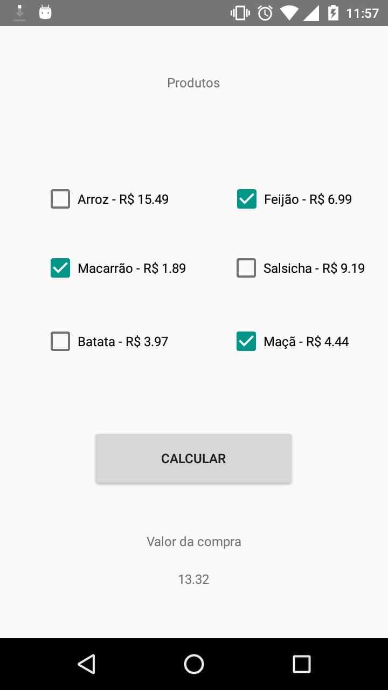

# Carrinho Compras feito em Android

Este é uma aplicação para a obtenção de notas na matéria de Programação de Aplicativos Mobile da ETEC Guaianazes, onde tem como objetivo ser uma lista de compras e fazer a soma de tudo.

## Interface:

